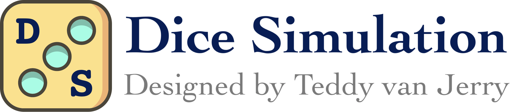

# Dice Simulation VS Code Extension

This is the extension for [**Dice Simulation**](https://github.com/Teddy-van-Jerry/Dice_Simulation),
with basic syntax highlight support and snippets.

## Basic Information
### Support Version
The version of Dice Simulation this extension bases on is `0.1.0`.

### Features
- Basic Syntax Highlight for `ds`, `ds-cpp`, `ds-h` based on [Better CPP Syntax](https://github.com/jeff-hykin/better-cpp-syntax).
- Snippets for DS Block.

## Screenshots

## Links

- Dice Simulation Website: https://dice.teddy-van-jerry.org
- Dice Simulation Repo: https://github.com/Teddy-van-Jerry/Dice_Simulation
- VS Code Extension Repo: https://github.com/Teddy-van-Jerry/Dice_Simulation_VSC

## License
This project is licensed under the [MIT LICENSE](LICENSE).